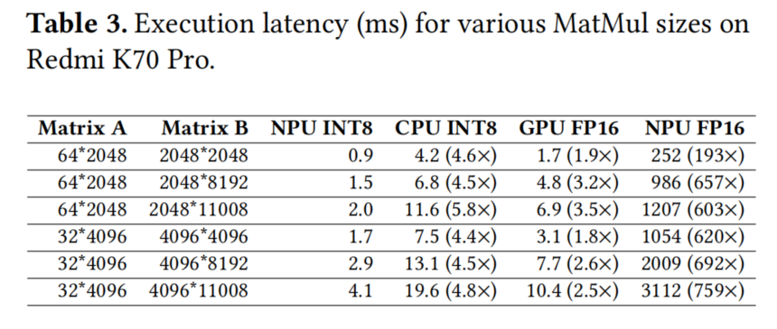
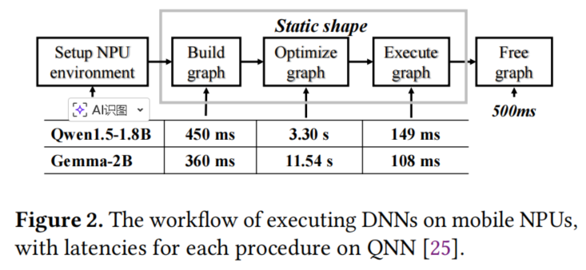
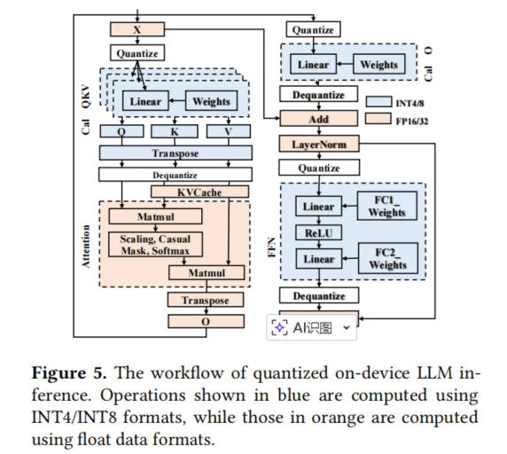
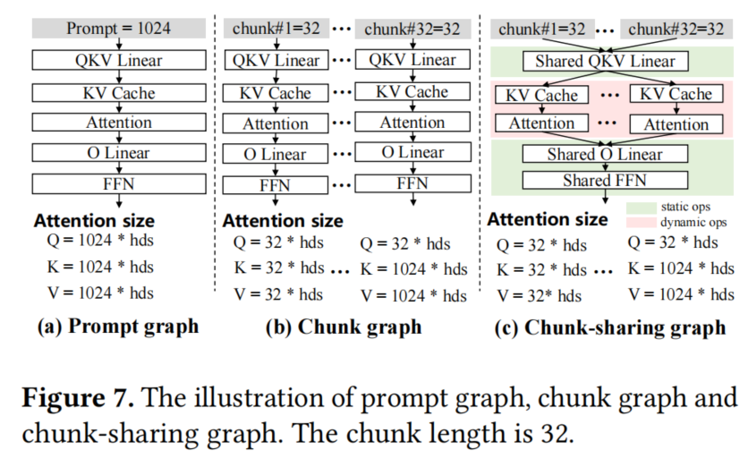
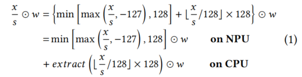
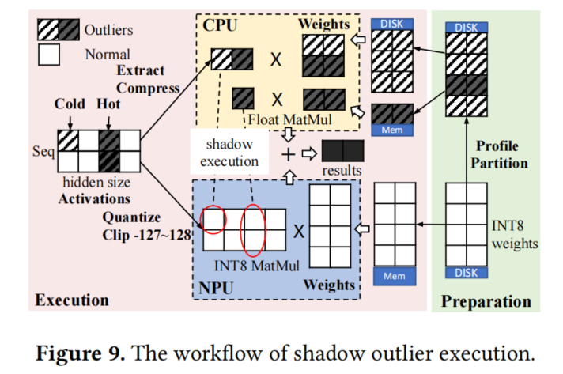
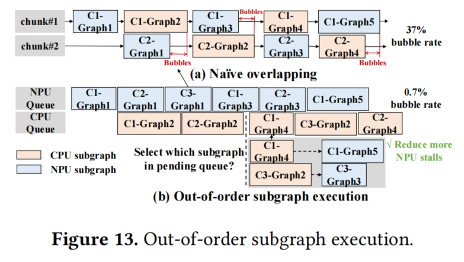
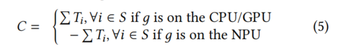

# Fast On-device LLM Inference with NPUs

论文在真实的端侧实现了基于NPU的LLM推理系统，提出了一系列优化方法来提升性能和效率，并且代码开源。
- **数据分析：**
  - **计算效率：** `Snapdragon 8 Gen 3` 的 `NPU` 计算`INT8` 的效率远高于`FP16`, 如下表
  
  - **Npu执行时间：** `NPU` 执行中计算图的构建与优化环节耗时最长，如下图

  - **精度：** 通常`LLM`推理中的`Attention`计算是需要更高精度(涉及到`softmax`层)，线性层的计算可以接受更低精度的量化。

- **核心方法：**
  - **分块共享图：** 移动NPU通常仅支持静态形状推理，为不同prompt长度生成不同计算图开销大，论文使用分块图共享方法，如下图c，对输入做分块处理，计算图中的线性层等无依赖部分共享，数据依赖部分不共享，相比直接块切分(图b)可以节约75%内存

  - **精度异常值提取：** 量化算法执行时存在异常激活值(outlier)，这部分需要高精度计算，论文把需要高精度计算的部分交给`CPU`，可以快速`INT8`计算的部分有`NPU`执行，如下图，

并且，异常值通常高度集中在部分通道,如下图，论文把常见通道权重备份到`CPU`,其余则直接从`Disk`加载

另外，部分异常值可以直接忽略对整体推理精度没有影响，论文通过大规模语料库数据对异常值重要性进行分析，剔除了大部分非关键层的异常值，进一步提升了效率。
  - **乱序子图执行：** NPU 的工作负载更重且构成关键路径，论文选择优化子图调度以减少 NPU 停滞，子图的执行顺序只遵循基本的依赖关系，如下图

具体来说，论文量化每个子图在NPU或者CPU/GPU上运行将会带来的依赖子图在NPU上的运行时间收益，例如当前子图部分在NPU运行，后续带来的非NPU子图运行时间收益是负值，对应下面公式的第二行。

- **实验结果：** 论文在`Snapdragon 8 Gen 3`上测试了`Qwen1.5-1.8B`模型可以达到`1106 token/s`的速度。
