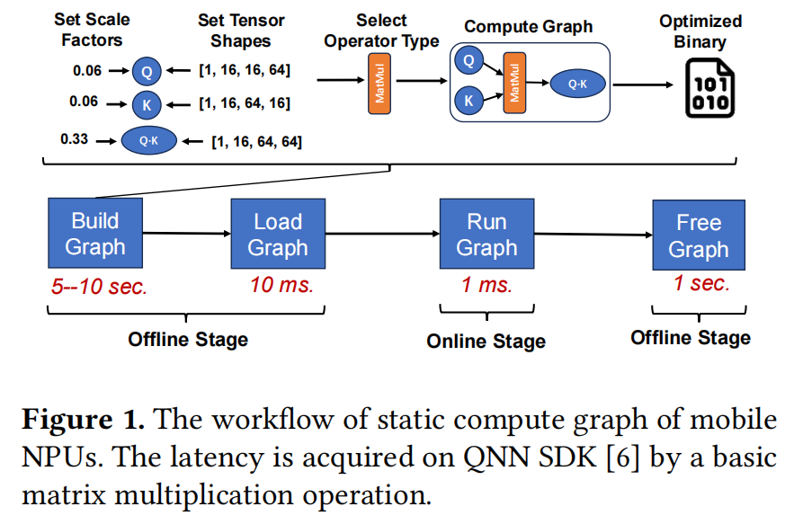
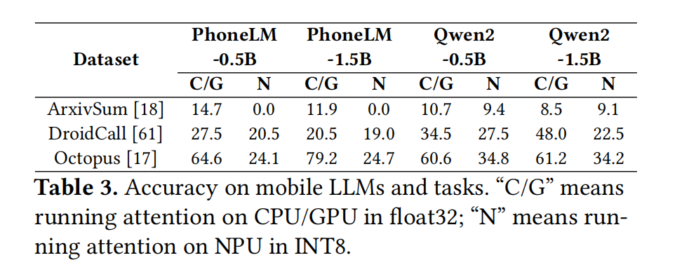
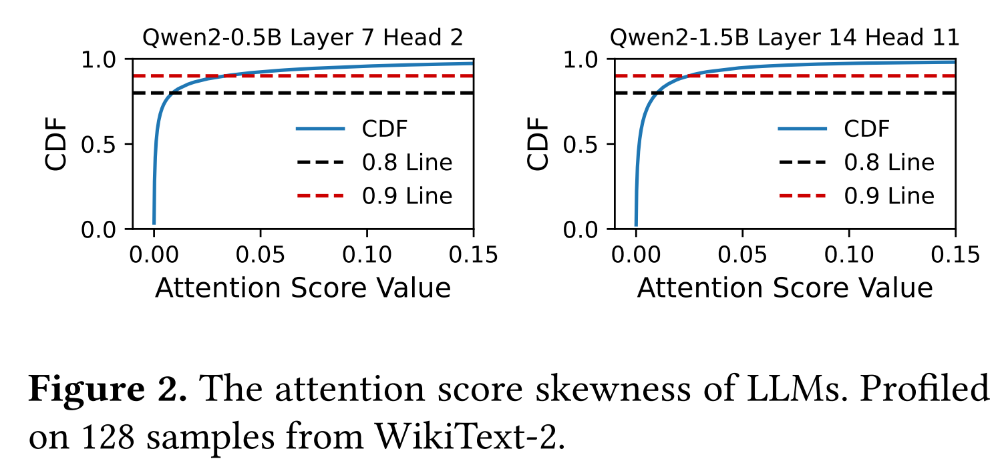
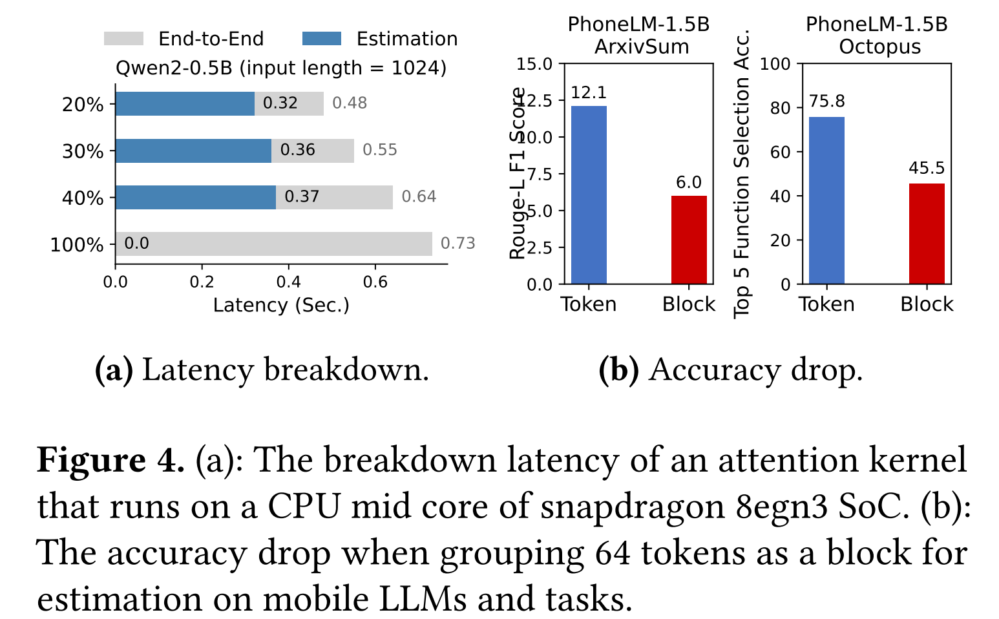

# Dynamic Sparse Attention on Mobile SoCs

论文提出`shadowAttn`, 解决移动设备上因精度需求使得模型需要在注意力层从`NPU`回退至`CPU/GPU`上执行的问题

- **核心分析：**
  - **耗时分析：** `NPU`的执行中离线建图的时间是最长的
  
  - **精度分析：** 注意力层的精度需求较高，在`NPU`上执行会使得精度大幅度降低
  
  - **注意力分析：** 超过90%的token注意力分数低于0.03
  
  - **稀疏注意力瓶颈：** 稀疏注意力包括下面阶段：(1)估计阶段：根据注意力分数筛选出重要的token；(2)计算阶段：使用选中的重要token计算稀疏注意力矩阵。由于估计阶段的时间难以降低，所以系数注意力的加速比提升有限，如下左图。
  
- **核心方法：**
