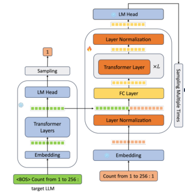
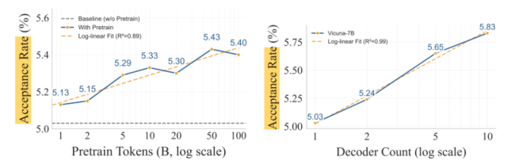
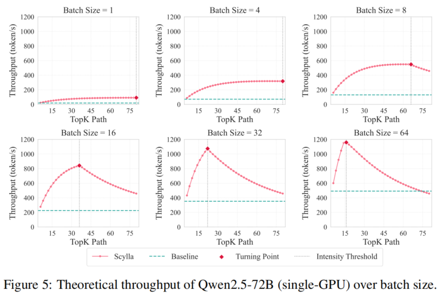
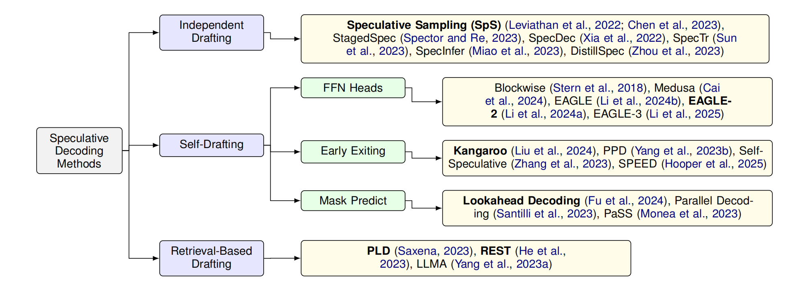
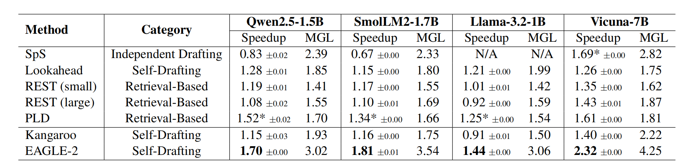
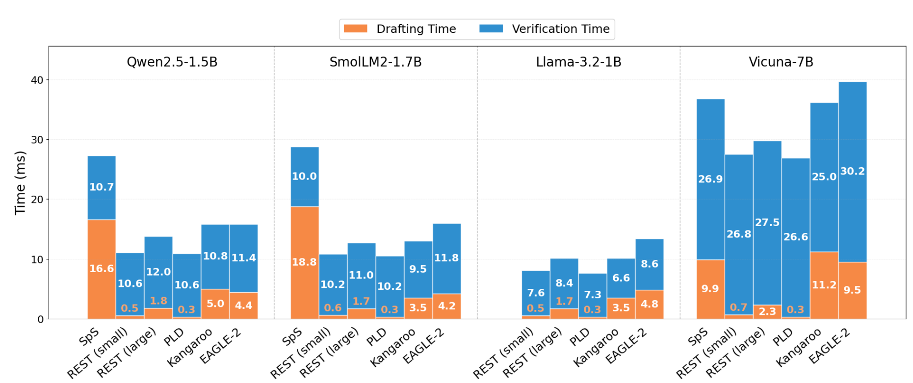
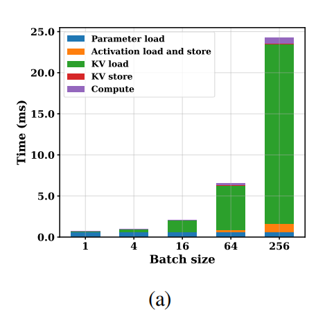
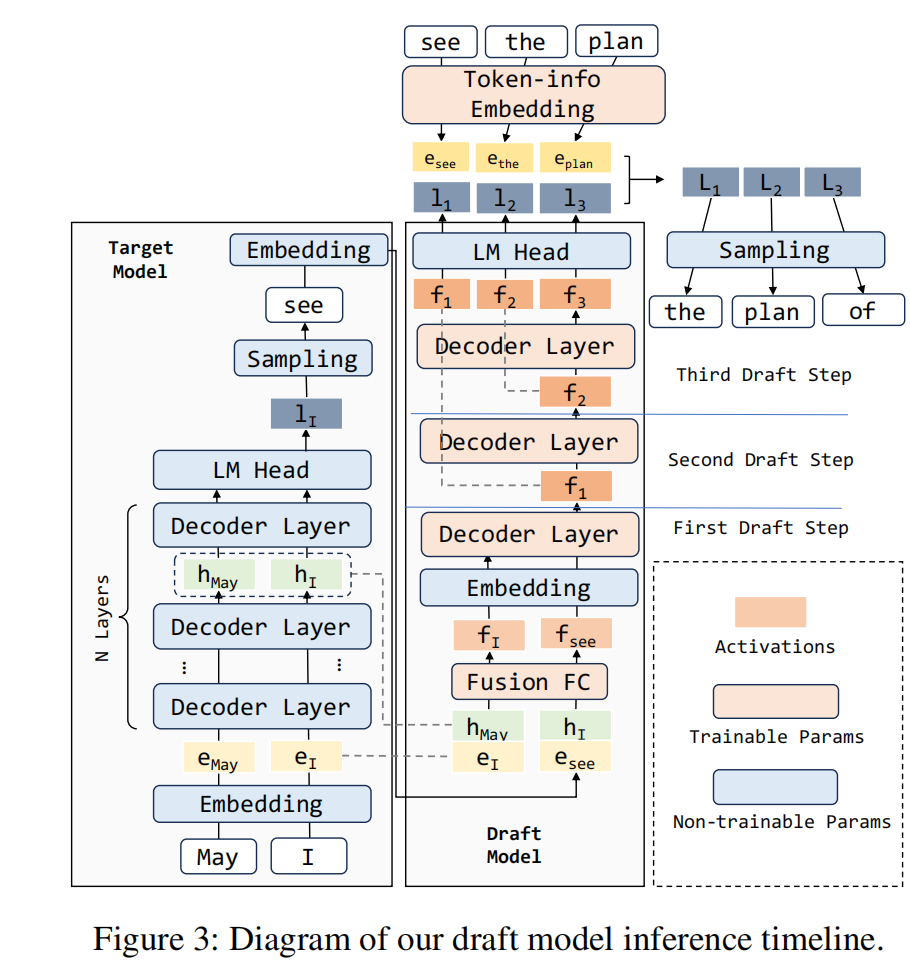
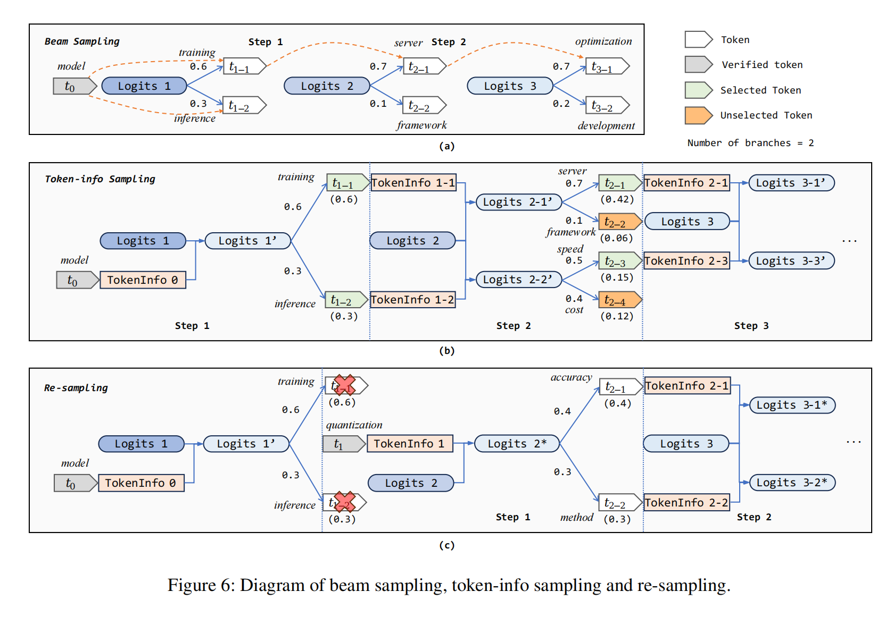
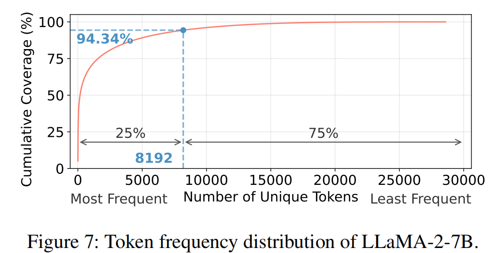

# 1. 草稿模型训练

## 1.1 Scaling Laws for Speculative Decoding

论文研究推测解码中的`Scaling Laws`，即草稿模型的接受率与其训练数据量和模型参数量的关系。
- 草稿模型的模型结构是`L`层注意力层+`Lm_head`层的结构，

- 增加训练数据token量(左图)，和模型参数量(右图)都能提升草稿模型的接受率，大致和成对数的线性关系，下图中横轴是对数轴, $R^2$检验接近0.99，说明拟合效果比较好。
 
- 分析了解码阶段的加速比，草稿路径变多会让整个解码从内存受限变为计算受限，存在一个最优拐点

## 1.2 An Empirical Study of Speculative Decoding for Small Language Models

论文主要研究了小模型的推测解码性能的主要影响因素：
- 做了推测解码的加速比建模: $\text{Speedup} = \frac{1 + E[\#\text{ accepted tokens}]}{1 + C_d/C_v}$, 其中$C_d$，$C_v$分别表示草稿模型和目标模型的计算时间。
- 把推测解码按照草稿方式分为三类: 独立草稿模型，自草稿模型，基于检索的草稿模型。这里独立草稿模型是指早期用完整小模型(例如同系列中小模型)给大模型打草稿，自草稿模型是指重新训练一小部分参数用于草稿，基于检索的草稿模型是指通过检索历史上下文来给大模型打草稿。

- 测试发现用完整小模型打草稿的方式加速比很低，原因是接受率低且因为窄且深的模型结构使草稿模型计算时间长。

- 用`Sps`完整小模型打草稿方式(`Qwen2.5-1.5B`的草稿模型是`Qwen2.5-0.5B`)时，草稿模型生成`2 token`需要16.6ms，而验证只需要10.7ms;相比之下`Eagle2`的草稿时间只需要4.4ms. 

- 这里还可以通过加速比公式解理论的接受率，例如`Speedup=1, 2token`在`Qwen2.5-1.5B`的草稿模型是`Qwen2.5-0.5B`情况下，接受率需要达到`77.5%`才能实现。
- 论文中关于`Eagle2`的理解应该有些误差，``Eagle2`的草稿模型是继承`Eagle1`，模型结构应该是线性自回归层，而不是注意力层。

## 1.3 MAGICDEC: BREAKING THE LATENCY-THROUGHPUT TRADEOFF FOR LONG CONTEXT GENERATION WITH SPECULATIVE DECODING

论文提出了`MAGICDEC`，通过分析批量处理规模与序列长度增长导致的瓶颈转移，据此优化推测性解码在高吞吐量推理中的部署策略。
- 论文核心观点：
  - 在长上下文与大批量处理场景中，键值缓存是主要瓶颈。
  
  - 推测解码仅在超过临界序列长度后才能提升吞吐量: 一定序列长度内，增大输入batch会让目标模型验证转向计算受限，推测解码加速比降低;超过临界长度后，增大输入batch会使得KV缓存转向内存受限，如上图
  - 论文提出通过压缩草稿模型的KV缓存来优化推测解码的部署策略.
- 加速比建模：
  - 在草稿模型接受率为$\alpha$，每次生成$\gamma$个token时，平均生成token数量为：$\Omega(\gamma,\alpha) := \mathbb{E}[\#\text{generated tokens}] = \frac{1 - \alpha^{\gamma+1}}{1 - \alpha}$; 
  - 推测解码总时间为，$\gamma$次草稿时间加上$\Omega(\gamma,\alpha)$个token的验证时间：$T_{Total}^{SD} = \gamma \cdot T_D(B,S) + T_V(B,S,\gamma)$
  - 整理的加速比(这里是倒数形式)为：$\frac{T_{Avg}^{SD}}{T_T} = \frac{1}{\Omega(\gamma,\alpha)} \left( \frac{\gamma \cdot T_D}{T_T} + \frac{T_V(\gamma)}{T_T} \right)$
  - 加速效果取决于三个主要因素：(a)目标验证与解码成本比$\frac{T_V(\gamma)}{T_T} $，(b)草稿与目标成本比$\frac{T_D}{T_T}$，以及(c)预期生成长度$\Omega(\gamma,\alpha)$。

## 1.4 Make Every Draft Count Hidden State based Speculative Decoding 

论文提出通过自回归注意力层，回收因验证失败而浪费的计算资源，观点是避免草稿隐藏状态受错误标记污染。
- 论文核心贡献是修改了草稿模型结构，对注意力层自回归，随后通过线性层+(可训练的`Embedding`层的归一化) 取得草稿`logits`，模型结构如下图所示。

- 采样：论文和`Medusa`一样最后的`logits`没有严格的上下文依赖关系，如果需要树形解码需要构建一个节点数量为$\sum_{k=1}^{K} \prod_{i=1}^{k} s_i$的草稿树($s_i$是第$i$个位置的采样数量)。 论文没有采取这个方法，因为其产生了大量冗余分支。论文使用类似`Beam Search`的方式，在每一步累计概率，而保留概率最高的`token`路径，如下图可见。
- 重采样。论文把上一步拒绝的草稿的下一步的`logits`添加到当前的草稿`logits`上，进行重采样。本质上，上一次和这一次的相同位置预测的是该位置可能的`token`，**直觉**这里的添加能一定程度增强该位置的预测分布，增加被接受的概率。示意图也如下。

- 另外还做了可训练的词表的压缩，依据长尾分布规律, 常见`token`是比较集中的, 如图, 只保留25%的词表在HBM中可以达到94%的覆盖度。

- 这里的采样还是有局限，相当于强行构建的依赖关系(从**对应路径概率更大**而进行剪枝的角度分析就合理些)，并且这里采样需要依赖上一个`token`的被训练嵌入向量，依旧需要自回归采样。另外实验也没有对比`Eagle3`，感觉草稿模型的预测准确度还是没打上来。

## 1.5 Speculative Speculative Decoding

论文核心是目标模型验证时同步进行草稿模型的解码，来提升推测解码的加速比。
- 草稿模型/目标模型是分离结构
- 感觉作为`2603`的论文，**从系统角度**看目标模型和草稿模型并行的出发点不够吸引(`EdgeLLM: Fast On-Device LLM Inference With Speculative Decoding`论文已有类似思想)。从算法角度来说，论文的理论推导和分析比较充分。
