# 推测解码系列论文深度解析

推测解码 是近年来大语言模型推理加速领域最重要的技术突破之一。其核心思想是"空间换时间"——使用轻量级草稿模型快速生成候选 token，然后由目标模型并行验证，从而打破自回归生成的串行瓶颈。本博客记录阅读过的相关领域的代表性工作。

---

## 1. Lookahead(基于词表预测)
### 1.1 Lookahead: An Inference Acceleration Framework for Large Language Model with Lossless Generation Accuracy
## TODO:
`Lookahead` 是基于词表预测的推测解码框架。它通过构建一个**字典树（Trie）**来并行预测未来多个 token 的分布，从而实现加速。
- **结构：** 分词组的**固定搭配**出现频率更高，所以用如下图第三行的**字典树**来构建`Draft Tree`候选树，并在每一步预测时并行验证树上的所有节点。
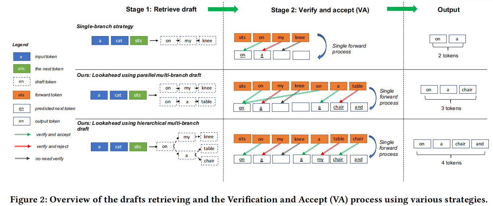
虽然这种方法在一定程度上提升了推理速度，但由于其**依赖于词表子集**，且无法适应上下文变化，接受率较低，实际加速效果受限。

- **草稿树：** 可以通过树形注意力一次前向传播并行验证所有候选 `token` 路径，极大地减少了推测解码的串行开销。简单来说就是通过大模型输入的`Position_id`来控制前后顺序，`Attention_Mask`来控制当前路径的可见前序`token`，如下图所示。
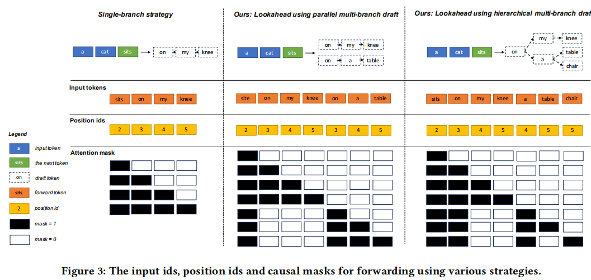

## 2. Speculative Decoding(大小模型预测)

## 3. MEDUSA(多头并行预测)

### 3.1 MEDUSA: Simple LLM Inference Acceleration Framework with Multiple Decoding Heads

`MEDUSA` 通过在大模型的最后一层隐藏层上并行挂载多个独立的 `Lm_head` 层，来实现多个未来位置的 `token` 分布预测，从而实现**完全并行化**的草稿生成。
- **模型结构：** `MEDUSA`的核心结构是在大模型的最后一层隐藏层上并行挂载了多个独立的`Lm_head` 层，每个头负责预测未来第 $i$ 个位置的 token 分布, 如下图。
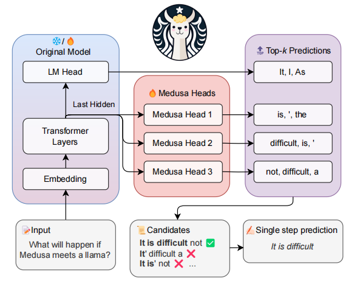

由于每个 `Medusa Head` 都是独立的，并且**没有任何依赖关系**，因此 `MEDUSA` 的草稿生成可以完全并行化，极大地降低了推测解码的延迟。

- **草稿树：**每个 `Medusa Head` 直接预测 token 分布，无法**形成各条完整的`token`路径**, 因此`MEDUSA`在每一步采集的候选 token 之间缺乏上下文依赖建模，接受率也受限。所以`Medusa`的草稿树需要将每个位置采样的结果进行排列组合，最终构建一个节点数量为$\sum_{k=1}^{K} \prod_{i=1}^{k} s_i$，其中$s_i$是第$i$个位置的采样数量，这里每个位置的采样数量可以根据不同的分布特征进行动态调整。
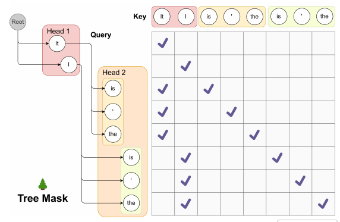

- **训练策略：** 两个方式，一是"冻结主模型，训练头"的策略，二是"联合训练主干模型和头层"。前者训练更快，但后者能获得更高的接受率。另外多头结构天然适合**自蒸馏**训练，缺乏高质量微调数据时，利用主模型自身生成的预测分布作为“标签”来训练头。

- **采样策略：** 典型接受方案（`Typical Acceptance Scheme`），接受超过概率阈值的`token`作为草稿.个人感觉这里还是因为**没有准确的上下文依赖**，不同解码分支路线上的词不能同时拟合到同一个`logits`分布上，举例如上图的`Head 1`采样`It,I`，这时对应下一步`Head 2`的分布来说, `It->is`和`I->is`的分布不可能同时你和到`Head 2`上，所以拒绝采样在这里不能准确对齐分布。

---

## 4. EAGLE(特征层自回归)

### 4.1 EAGLE: Speculative Sampling Requires Rethinking Feature Uncertainty

`Eagle` 提出通过**特征层自回归**进行草稿生成
- **模型结构：** `EAGLE` 引入了特征层自回归的范式, 不只是用`token`的`embedding`作为输入，而是将前一层的隐藏状态 $h_{t-1}$ 以及当前 `token` 的嵌入向量作为输入。同时模型结构由完整的小模型，变为一个自回归的线性层+原模型的 `LM Head`层，如下图所示。
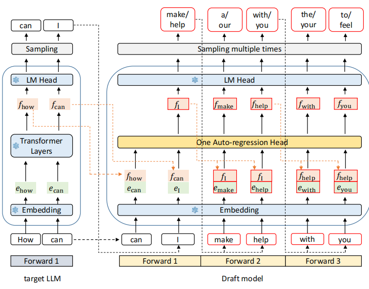

- **训练策略：** 论文提出了**特征损失（Feature Loss）**，通过最小化草稿模型和目标模型在隐藏层特征空间的距离来提升草稿模型的预测准确度。具体来说，除了传统的 token 预测损失外，还引入了一个额外的损失项，衡量草稿模型生成的隐藏状态与目标模型对应层的隐藏状态之间的差异：
$$\mathcal{L} = \mathcal{L}_{reg} + w_{cls} \cdot \mathcal{L}_{cls}$$
其中 $\mathcal{L}_{reg}$ 是特征层预测的交叉熵损失，$\mathcal{L}_{cls}$ 是`token`预测的损失,$w_{cls}$ 是权重超参数。

- **草稿树：** `EAGLE` 的草稿树是基于特征层自回归生成的，所以每个节点的`token`都依赖于前一个`token`，相比于`Medusa`可以构建具备依赖的草稿树，大幅减少了节点数量，草稿树示意图如下。
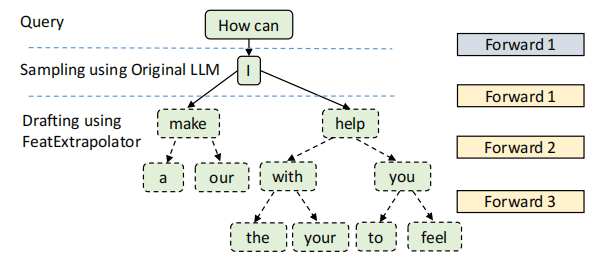

## 5. EAGLE-2(动态草稿树)

### 5.1 EAGLE-2: Faster Inference of Language Models with Dynamic Draft Trees

`EAGLE-2` 提出了草稿 token 的接受率不仅与位置有关，更高度依赖于**上下文环境**，引出**动态草稿树**机制。

- **动态树结构：** 每一次草稿都向下扩展节点，然后按照当前节点的概率(从根节点到该节点的概率累乘)进行排序，保留概率最高的前 $k$ 个节点，形成新的草稿树，随后通过一次`tree attention`(实际还是一维数据)继续进行草稿生成/验证，如下图所示。
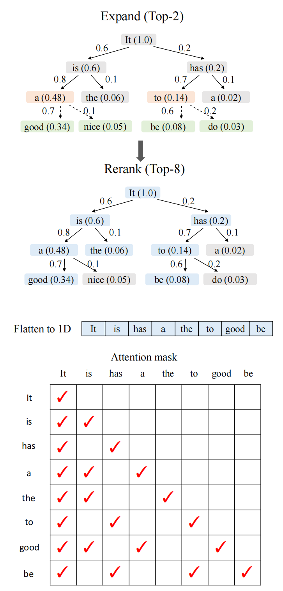

## 6. EAGLE-3(数据 Scaling)

### 6.1 EAGLE-3: Scaling up Inference Acceleration via Training-Time Test

`EAGLE-3` 解决了推测解码模型**拉大训练数据规模对草稿模型提升有限**的问题

- **模型结构：** 如下图所示, 草稿模型首先扩大了输入数据，从模型的浅层/中层/深层获得激活，通过一层线性层投影回正常的`hidden`大小，并且拼接上一个`token`的嵌入向量作为输入，来进行草稿预测。草稿模型的模型结构是自回归的(线性投影层 + 一层注意力层 + 输出的`Head`层)。
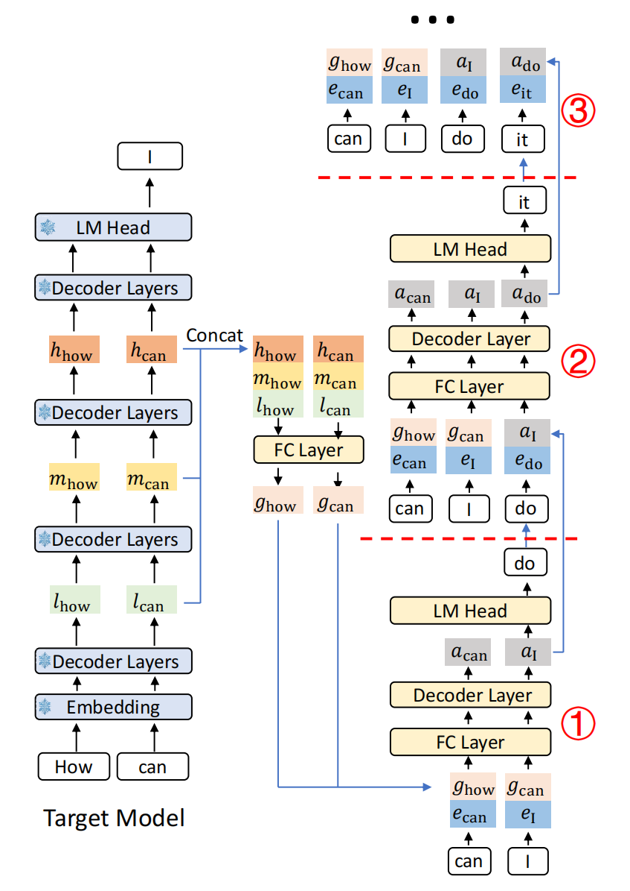

- **训练策略：** 论文最核心的要点，在`Eagle`中模型训练通过加权`token`损失和`feature`损失进行训练，如下图。
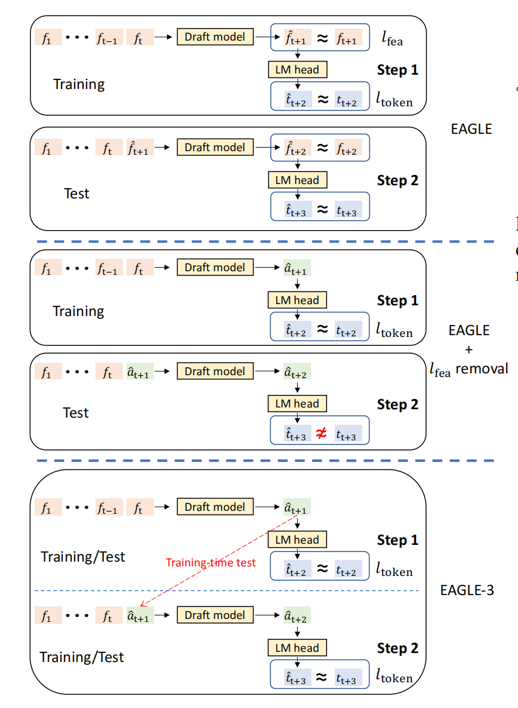
虽然使用`feature`损失可以让草稿模型更快地拟合目标模型的特征分布，从第0步的预测推广到第1步的预测(如下图黄线，0-$\alpha$可以很好推广到1-$\alpha$), 但它也限制了草稿模型从数据量中获得的表达能力提升(下图黄线中0-$\alpha$，去掉`feature`损失可以从横坐标的数据规模变大中获得更大接受率，而红线该规律不明显)。
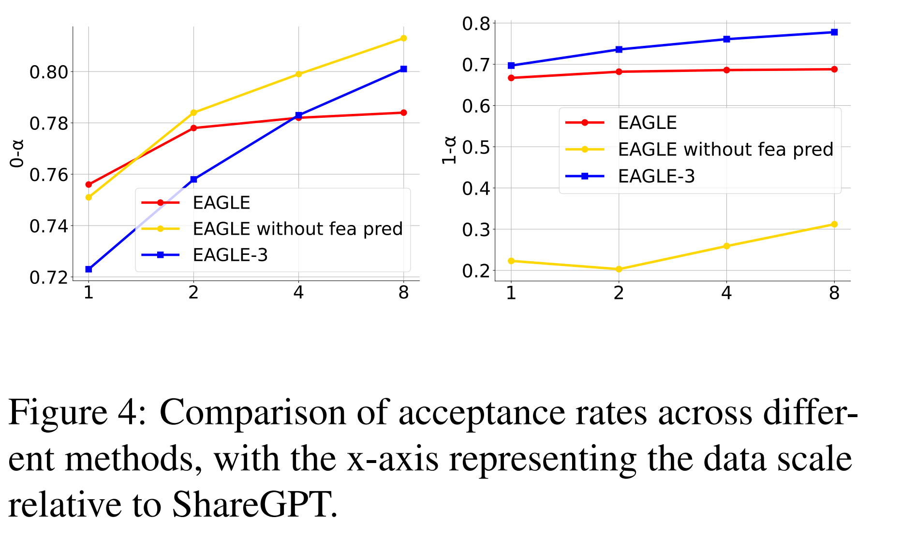
于是`EAGLE-3` 直接去掉了`feature`损失，改为**Training-Time Test**，直接以 `token` 预测为目标(上上图的中间部分)，并且为了弥补1-$\alpha$带来的准确率降低问题，`Eagle-3` 把草稿模型生成的`token`纳入后续草稿模型的训练输入中(上上图的最底部分)，这种方法让草稿模型能够更充分地利用大规模数据的表达能力提升。
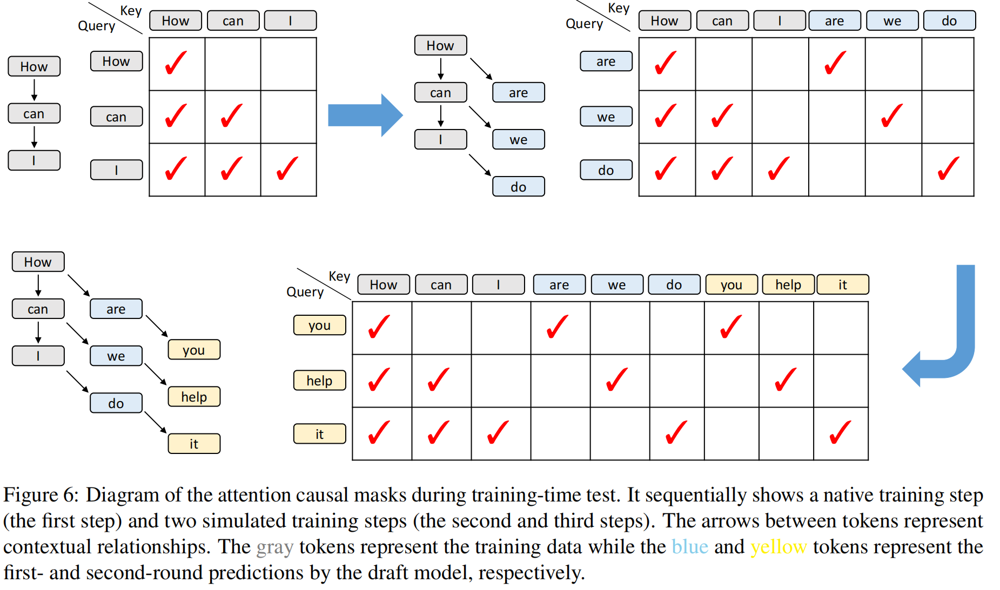
在训练过程中，草稿模型需要对每个位置都要有自己的延申分支，如上图`How, Can, I`三个`token`都分别向下延申一个分支，使得训练过程的计算和显存提高。

- **加速效果：** 最后实验效果相当惊人，能达到约6步的平均接受长度
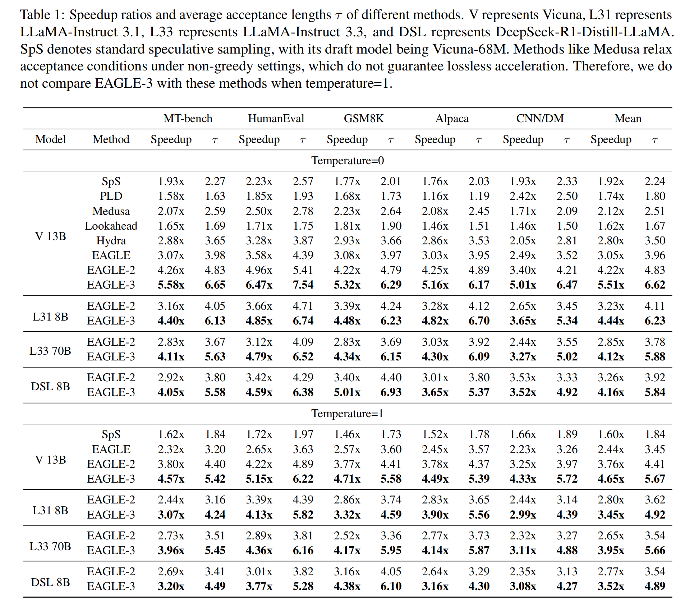
并且每一步的预测接受率都能达到约80%，不会随着预测的步长增加而明显下降。
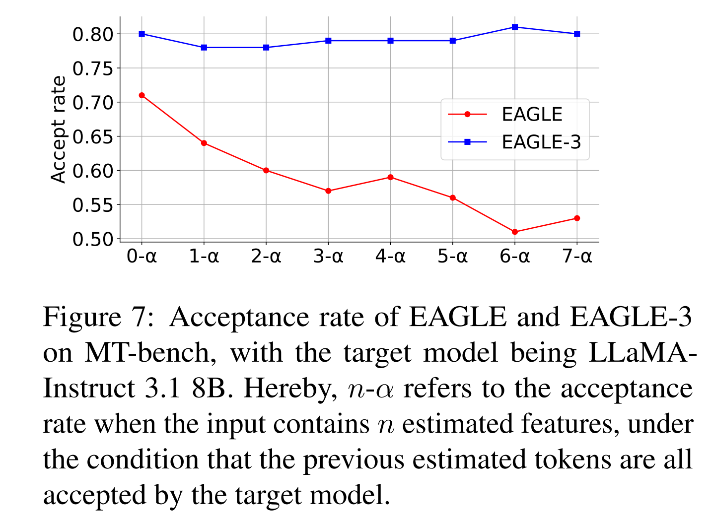

---
### 7. 小结

---

## 7. 突破瓶颈：并行化与扩散思路

### 7.1 DFlash: Block Diffusion for Flash Speculative Decoding

`DFlash` 引入了**扩散模型（Diffusion Model）**打破草稿模型自回归生成的串行限制。
- **分析建模：** 单个`token`解码时间平均为：$L = \frac{T_{\text{draft}} + T_{\text{verify}}}{\tau},$其中$\tau$是接受长度，对u有自回归草稿模型需要$\gamma$步生成草稿，时间为：$T_{\text{draft}} = \gamma \cdot t_{step}$，而扩散模型草稿时间与生成长度无关：$T_{\text{draft}} = t_{parallel}$。由此, 对于不同草稿模型预测长度，扩散模型的草稿时间不变。
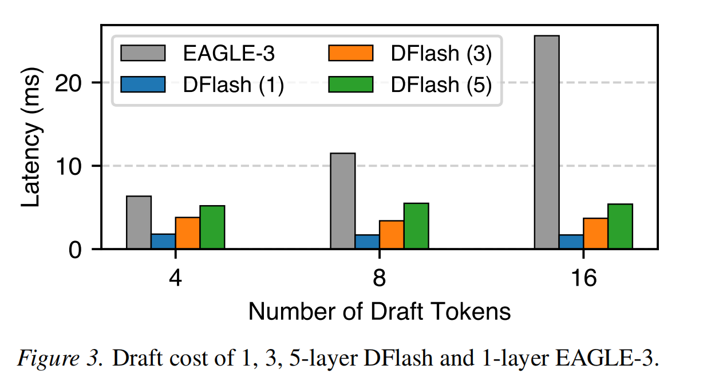
- **模型结构：** 如图，草稿模型使用多各双向注意力层+输出`Head`层结构，本质上拉大了模型的参数规模。这里草稿模型预测时使用`<mask>`标记未来位置的输入，一次生成多个位置的`token`。另外，论文从目标模型的浅层到深层均匀采样激活并通过线性层投影到隐藏层维度，随后作为每一层的`KVcahe`注入到各个双向注意力层中。
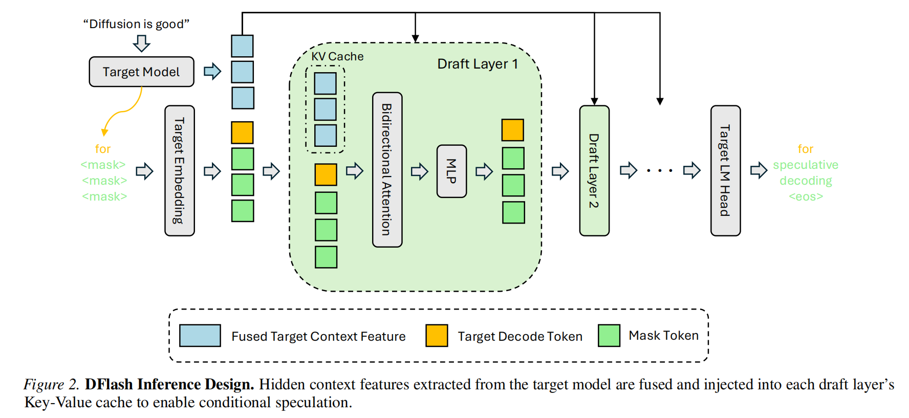
- **加速效果：** 在小模型上的测试中，单步接受步长可以达到6-7步，非常夸张。但是注意这里的测试是16层双向注意力层结构，实际给模型scale拉大了。
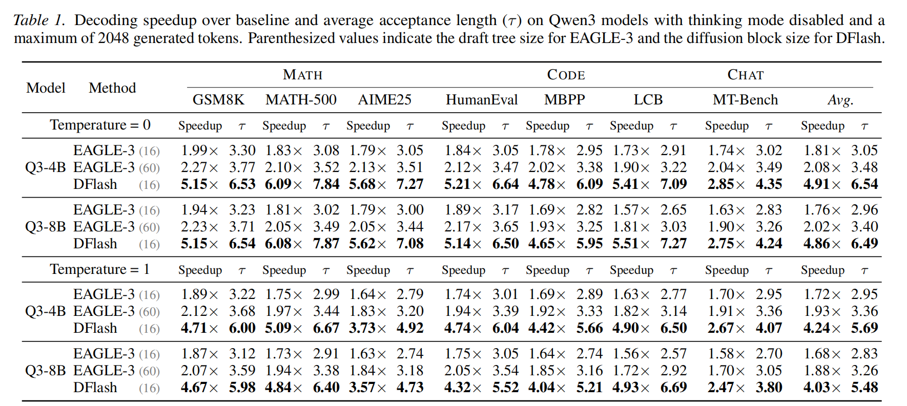

### 7.2 P-EAGLE: Parallel-Drafting EAGLE with Scalable Training

`P-EAGLE` 将 `EAGLE` 从“特征自回归”转变为“特征并行化”，同样实现一步预测多个位置的草稿生成。
- **模型结构：** 一层线性投影层+**多层**多头注意力层+目标模型的`LM Head`层结构。这里草稿模型的输入和`Eagle3`相似，上下文部分的输入是目标模型的`浅/中/深层`的投影与`token`嵌入向量的拼接；而待预测的位置的输入则是共享隐藏状态向量+特殊的`<mask>`标记的嵌入向量，这里的两部分都是可以学习的。
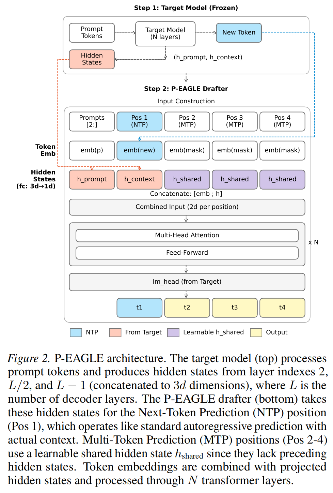

- **核心分析：**
  - 训练显存：`Eagle3`方法需要在每个位置上都要有一个分支，训练长度是 $O(nK)$ , `PARD`论文随机丢弃部分分支，第一个位置保留 $O(nr)$ ，第二个位置保留 $O(nr^2)$，以此类推，第$k$个位置保留 $O(nr^k)$，其中$r\in (0,1) $是保留率。在长文本场景下容易超显存, 如下表`OOM`。

   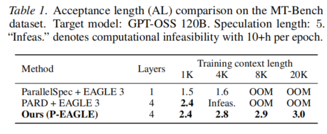
   - **位置不变性：** 论文发现每个训练的位置的因果结构具有位置不变性— TODO:

   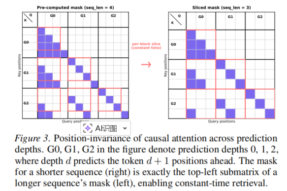

**训练策略：** 开发了 `Amortized Mask Construction`（预计算掩码）和 `Sequence Partitioning`（序列分区梯度累积）技术，支持高达 **20K** token 的长序列训练，显著提升了模型在复杂上下文下的推测稳定性。

---

## 8. 细节优化

### 8.1 FR-Spec: Accelerating Large-Vocabulary Language Models via Frequency-Ranked Speculative Sampling

论文提出了 `FR-Spec`，将草稿模型的词表进行压缩
- **长尾分布：** 大部分词表的token出现频率较低，如图25%的词表覆盖了95%的token出现频率。
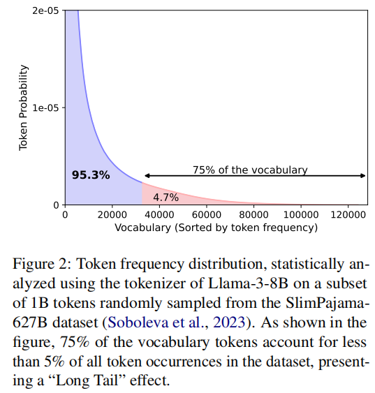
- **时间分析：** 草稿模型的`head`层在大词汇表情况下大概耗49%的草稿时间
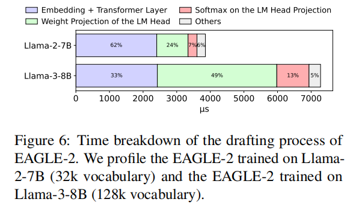
- **频率排序的草稿机制：** `FR-Spec` 根据词表中 token 的出现频率对候选词进行排序，优先选择高频词作为草稿预测的候选，从而减少不必要的计算开销。

### 8.2 Draft Model Knows When to Stop: Self-Verification Speculative Decoding for Long-Form Generation

论文提出`SVIP`，解决传统推测解码使用固定长度的草稿策略带来的可接受性波动极大问题
- **核心分析：** 拒绝草稿模型`token`处的**KL散度**高于接受草稿模型`token`处，并且预测长度越长，拒绝概率越大，接受概率越小。如下图
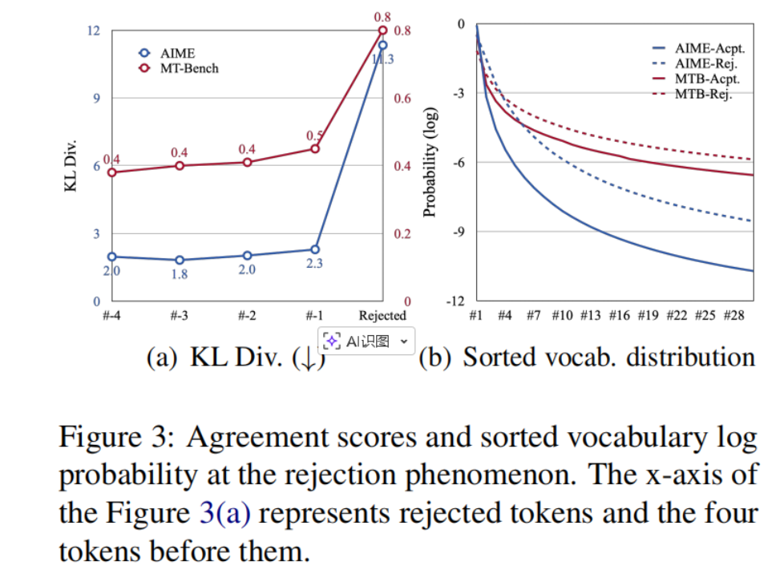
- **核心方法：**  由于草稿模型与目标模型的KL散度难以估计，论文从采样概率开始进行缩放分析，使用草稿模型**预测熵**作为代理来近似接受率下界。 

---

## 九、总结

---

## 参考文献

1. Cai et al., "MEDUSA: Simple LLM Inference Acceleration Framework with Multiple Decoding Heads", ICML 2024
2. Li et al., "EAGLE: Speculative Sampling Requires Rethinking Feature Uncertainty", ICML 2024
3. Li et al., "EAGLE-2: Faster Inference of Language Models with Dynamic Draft Trees", ACL 2024
4. Li et al., "EAGLE-3: Scaling up Inference Acceleration via Training-Time Test", 2025
5. Chen et al., "DFlash: Block Diffusion for Flash Speculative Decoding", 2026
6. Hui et al., "P-EAGLE: Parallel-Drafting EAGLE with Scalable Training", 2026
7. Kumar et al., "Speculative Speculative Decoding", 2026
8. Williams et al., "Speculative Decoding with a Speculative Vocabulary", 2026
9. Zhang et al., "Draft Model Knows When to Stop: Self-Verification Speculative Decoding for Long-Form Generation", EMNLP 2024
4
